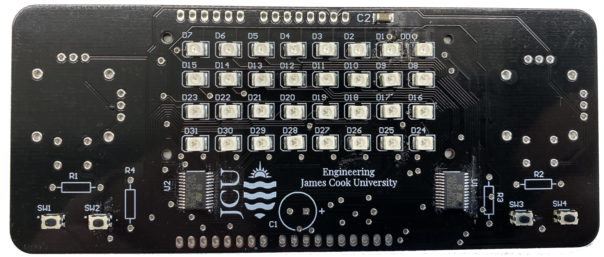

# Assembly instructions (for through-hole components)

If you received a board with the LEDs and other surface mount components already soldered, then you must solder the following components:

 * 10 kΩ resistors at R1 and R2.
 * 2.4 kΩ resistors at R3 and R4.
 * 100 μF capacitor at C1. Be careful not to put the component in backwards! These capacitors have a negative terminal marked with minus signs on a vertical stripe. Put the negative sign away from the "+" marked on the circuit board. If in doubt, ask your tutor!
 * 2 x joysticks. You may need to carefully bend the pins to make them line up with the holes on the circuit board.
 * Headers along the edges of the board. Hint: you can use an Arduino to hold the headers in place to keep them straight while you solder.

## Important notes
 
* Make sure you solder C1 the correct way around! Check with your tutor.
* The legs on R3 will sit close to the USB port on the Arduino once it is plugged in. Make sure that you trim the legs very short so they don't contact with the USB port.

