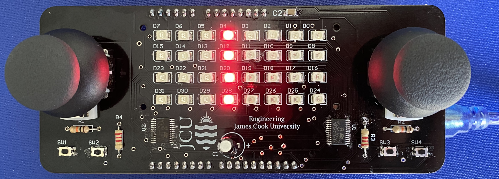

# Light grid Arduino shield 

Open-source hardware and software for an Arduino shield with a grid of lights. Used at James Cook University for soldering practice and embedded systems programming practice.

This device consists of 32 individually controllable LEDs, two analog joysticks, and four switches. It can be controlled from an Arduino Uno or a NXP FRDM development board.

## Assembly instructions

If you received a board with the LEDs and other surface mount components already soldered, then please refer to the [through-hole assembly instructions](Documentation/Through-Hole-Assembly.md).

## Software instructions 

If you are using an Arduino to control the shield, there is a pre-made driver library and some example applications. Refer to the [Arduino software instructions](Documentation/Arduino-Library.md) for more information.

## Technical documentation 

For technical details, refer to the [electrical schematic](Documentation/Schematic.pdf) for the circuit.
